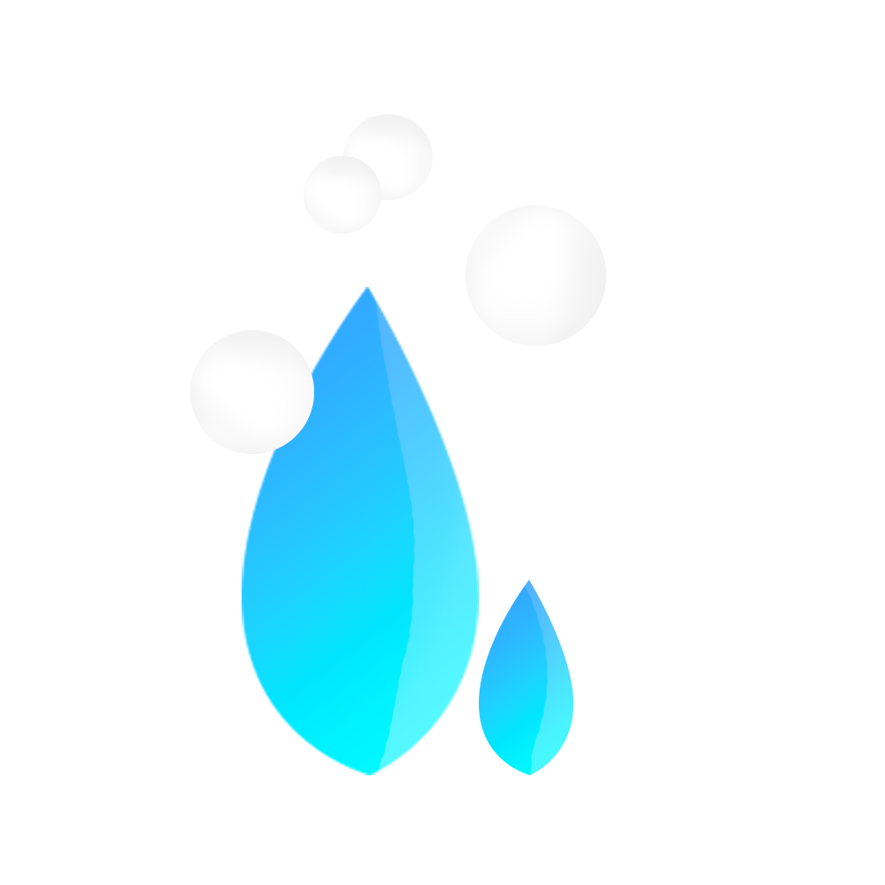

  

# App Leidy
## Sobre

### Intuito
O projeto tem o intuito de criar um app de serviços de limpeza e afins.

### Como foi feito
O app surgiu com a ideia de entrar no mercado de tecnologia ao mesmo tempo em que abre oportunidades de serviço para a região, sendo destinado para a região de <b>Jaraguá do Sul/SC</b> e demais próximos. Fixa no objetivo em se consolidar em prestação de serviços e "empregadores", se tornando uma "ponte" entre os mesmos.

### Adicionais
- O projeto está ainda em andamento.
- Foi o maior projeto em duração que já fiz(inteiramente meu), principalmente por causa das dificuldades atuais no desenvolvimento mobile(erros e problemas durante o desenvolvimento)
- A maior dificuldade que tive foi pelas limitações da plataforma mobile e o design já que em grande parte sou desenvolvedor back-end.>
- Fiz do zero, desde as concepções e projeção de design. Havia anteriormente feito o sistema back-end mas foi reformulado por:
##

  
  
<a href="https://github.com/joohnyfranzen">Jonathan Franzen Fagundes</a>

  <h5 align="center"><a href="https://github.com/joohnyfranzen/Leidy-Nest-App">joohnyfranzen/Leidy-Nest-App</a></h>

## Detalhes
### Como iniciar

1. Abra interface de comando dentro do diretório já descompactado.
2. Utilize `npm install` para instalar as dependências da aplicação.
3. Digite `npm start` para a inicialização do projeto.

### Tecnologias

 - Foi projetado com a ferramenta web <b>Figma</b> (Telas e adicionais).
 - Desenvolvido com o Framework <b>React Native</b>.
 - Compilado com a ajuda da ferramenta <b>Expo</b>.
 - Integração com API feita com a biblioteca <b>Axios</b>.
 - Ajuda com design nativo com a biblioteca <b>React Native Paper</b>.
 - Contexto/variaveis globais(token, error, loading, login) com a biblioteca <b>Redux</b>.
 - Auxilio no design com a biblioteca <b>Ionicons</b>.
 - Ajuda com dificuldade em certas estilizações com a biblioteca <b>Styled Components</b>.
